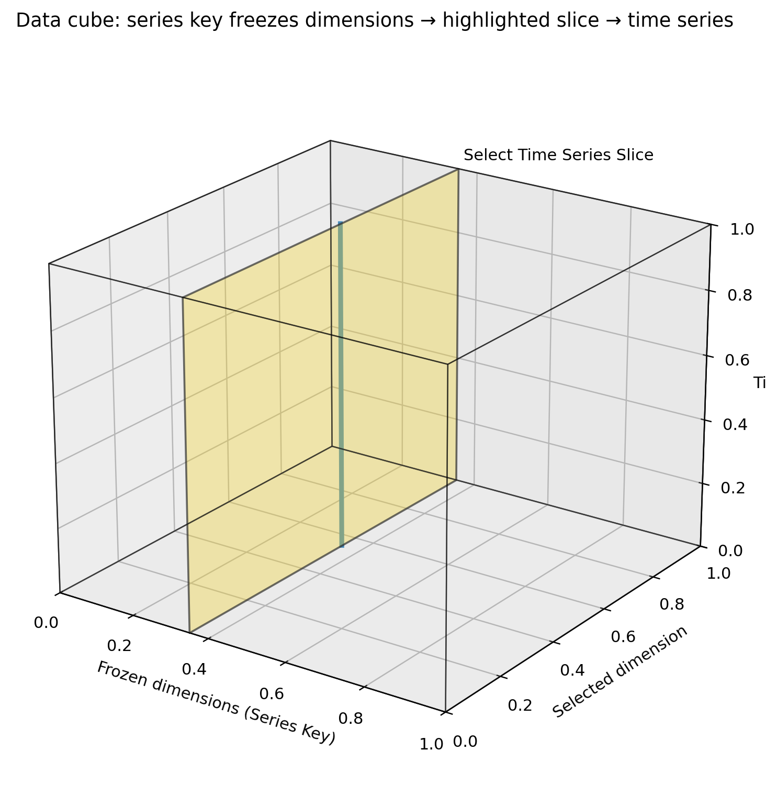
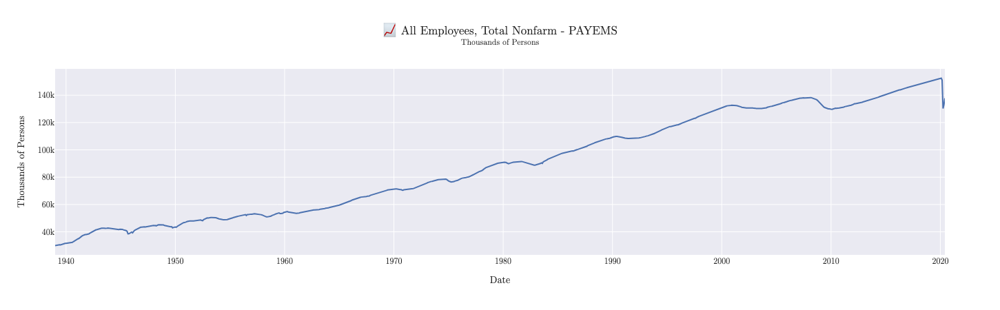
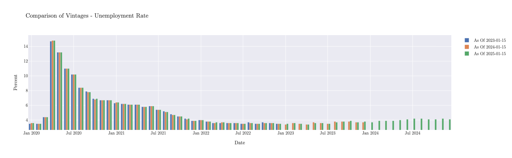

# Quick Start

This guide will help you get started with MacroTrace in just a few minutes.

## Basic Workflow

MacroTrace follows a simple workflow:

1. **Initialize a time series** with dataset ID and source
2. **Automatically fetch data** from the source (FRED, ONS, etc.)
3. **Store data** in the local database with revision tracking, faster future loading, offline access, and ease of creation of replication packages
4. **Analyze** time series with revision history

## Loading Time Series Data from FRED

Let's start by loading employment data from FRED:

```python
from macrotrace import MTTimeSeries

# Load time series - this automatically fetches and stores data
payems_series = MTTimeSeries(
    dataset_id="PAYEMS",
    source="fred"
)

# View the series
print(payems_series)
```

Just by initiating the `MTTimeSeries` object, MacroTrace will fetch the Total Nonfarm Payrolls series from FRED, and store it locally. When you print the object, you get a summary of the series including its revision history:

```python
Time Series: PAYEMS (All Employees, Total Nonfarm)
Source: FRED
Units: Thousands of Persons
Latest Vintage Date: 2025-12-16
Vintages: 71 available from 2020-01-10 to 2025-12-16
+------------+----------+
| Timestamp  |  Value   |
+------------+----------+
| 2025-02-01 | 159155.0 |
| 2025-03-01 | 159275.0 |
| 2025-04-01 | 159433.0 |
| 2025-05-01 | 159452.0 |
| 2025-06-01 | 159439.0 |
| 2025-07-01 | 159511.0 |
| 2025-08-01 | 159485.0 |
| 2025-09-01 | 159593.0 |
| 2025-10-01 | 159488.0 |
| 2025-11-01 | 159552.0 |
+------------+----------+
```

## Loading Time Series Data from the ONS with a Series Key

While FRED's API provides datasets as a single dimensional time series, other APIs like the ONS require specifying a `series_key` to identify the desired series within a multi-dimensional dataset.



The dataset can be thought of as a multi-dimensional cube, where each dimension corresponds to a variable (e.g., geography, industry classification). The `series_key` parameter is a dictionary that maps dimension names to specific values to filter the dataset.

```bash
+------+------------+-----------+----------+
| gdp  |    date    | geography | industry |
+------+------------+-----------+----------+
| 1000 | 2023-01-01 | K02000001 |   A--T   |
| 1010 | 2023-04-01 | K02000001 |   A--T   |
| 1025 | 2023-07-01 | K02000001 |   A--T   |
| 1035 | 2023-10-01 | K02000001 |   A--T   |
|  40  | 2023-01-01 | K02000002 |    A     |
|  35  | 2023-04-01 | K02000002 |    A     |
|  45  | 2023-07-01 | K02000002 |    A     |
|  50  | 2023-10-01 | K02000002 |    A     |
|  60  | 2023-01-01 | K02000002 |    B     |
|  65  | 2023-04-01 | K02000002 |    B     |
+------+------------+-----------+----------+
```

The dataset can also be thought of as a table, where each row represents a unique combination of dimension values. The `series_key` helps select the specific rows (time series) where the dimension values match those specified in the dictionary.

<br>

Here's an example of loading UK GDP data from the ONS using a `series_key`:

```python
# Load UK GDP data
gdp_series = MTTimeSeries(
    dataset_id="gdp-to-four-decimal-places",
    source="ONS",
    series_key={
        "geography": "K02000001",
        "unofficialstandardindustrialclassification": "A--T",
    },
)
print(gdp_series)
```

Printing the `gdp_series` object will give you a summary same as before:

```python
Time Series: gdp-to-four-decimal-places (GDP monthly estimate (incorporating the Index of Services and Index of Production))
Source: ONS
Units: Index. Seasonally adjusted 2016=100
Latest Vintage Date: 2025-12-12
Vintages: 19 available from 2024-05-10 to 2025-12-12
+------------+----------+
| Timestamp  |  Value   |
+------------+----------+
| 2025-01-01 | 101.7752 |
| 2025-02-01 | 102.2245 |
| 2025-03-01 | 102.5781 |
| 2025-04-01 | 102.3277 |
| 2025-05-01 | 102.3578 |
| 2025-06-01 | 102.749  |
| 2025-07-01 | 102.633  |
| 2025-08-01 | 102.582  |
| 2025-09-01 | 102.5002 |
| 2025-10-01 | 102.3731 |
+------------+----------+
```

## Filtering Vintage and Data Start/End Dates

When loading a time series the entire history of vintages and data is fetched by default. You can filter the vintages and data by specifying `vintage_start_date`, `vintage_end_date`, `data_start_date`, and `data_end_date` parameters.

The following example loads the unemployment rate series from FRED, but only fetches vintages between January 1, 2020 and December 31, 2025:
```python
# Load unemployment rate data with specific vintage date ranges
unemployment_limited_vintages = MTTimeSeries(
    dataset_id="UNRATE",
    source="fred",
    vintage_start_date="2020-01-01",
    vintage_end_date="2025-12-31",
)
```
Note that when specifying vintage date ranges, the only vintages that fall within the specified range will be fetched and stored.

You can filter the data points by specifying `data_start_date` and `data_end_date`:

```python
# Load unemployment rate data with specific data date ranges
unemployment_limited_data = MTTimeSeries(
    dataset_id="UNRATE",
    source="fred",
    data_start_date="2023-01-01",
    data_end_date="2025-12-31",
)
```
Note that when specifying data date ranges, all vintages will be fetched, but only data points that fall within the specified range will be returned. This is to ensure that should different data start/end dates be specified in future loads, the full revision history is still preserved.

```python
# Load unemployment rate data with specific date & vintage ranges
unemployment_limited = MTTimeSeries(
    dataset_id="UNRATE",
    source="fred",
    data_start_date="2020-01-01",
    vintage_start_date="2023-01-01",
    vintage_end_date="2025-12-31",
)
```

These can also be combined to limit both the vintages and data returned.

## Working with Vintages

MacroTrace tracks all historical vintages of a time series and surfaces tools to work with them. For example, you can retrieve the vintage of the time series as of a specific date, generate various plots, or a vintage matrix showing all revisions over time.

Using the `as_of` method on our earlier `payems_series` we can view the data as it was known on July 15, 2020. Note that the as_of method returns a new `MTTimeSeries` object representing the vintage as of that date.
```python
# Get a vintage as of a specific date
vintage_2020_07 = payems_series.as_of("2020-07-15")
print(vintage_2020_07)
```

Notice in the output below how the data reflects the values known as of that date, including the significant drop in employment due to the onset of the COVID-19 pandemic:
```python
Time Series: PAYEMS (All Employees, Total Nonfarm)
Source: FRED
Units: Thousands of Persons
Latest Vintage Date: 2020-07-02
Vintages: 785 available from 1955-05-06 to 2020-07-02
+------------+----------+
| Timestamp  |  Value   |
+------------+----------+
| 2019-09-01 | 151368.0 |
| 2019-10-01 | 151553.0 |
| 2019-11-01 | 151814.0 |
| 2019-12-01 | 151998.0 |
| 2020-01-01 | 152212.0 |
| 2020-02-01 | 152463.0 |
| 2020-03-01 | 151090.0 |
| 2020-04-01 | 130303.0 |
| 2020-05-01 | 133002.0 |
| 2020-06-01 | 137802.0 |
+------------+----------+
```

## Plotting
We can visualize the July 2020 vintage using the built-in plotting functionality:

```python
vintage_2020_07.plot.timeseries()
```



If we wanted to compare multiple vintages, we can use the `plot.timeseries_comparison` method:

```python
unemployment_limited.plot.timeseries_comparison(
    vintage_dates=[
        "2023-01-15",
        "2024-01-15",
        "2025-01-15",
    ]
)
```



## Database & Cache Location

By default MacroTrace creates two SQLite files in the directory you run
Python from:

- `MacroTrace.db` — the local data store with all observations, releases,
  and series metadata.
- `MacroTraceRequestCache.sqlite` — the HTTP response cache for FRED and
  ONS, used to avoid repeating identical API requests.

You can override either path. Resolution order is **constructor argument →
environment variable → default in the current working directory**:

```python
# Per-call override
series = MTTimeSeries(
    dataset_id="PAYEMS",
    source="fred",
    db_path="/data/macrotrace/lab.db",
)
```

```bash
# Project- or shell-wide override
export MACROTRACE_DB=/data/macrotrace/lab.db
export MACROTRACE_CACHE=/data/macrotrace/cache.sqlite  # optional
```

If `MACROTRACE_DB` is set but `MACROTRACE_CACHE` is not, the request cache
is placed next to the database file so the two stay together.

## Working with Pandas/Darts

You can convert the time series data to a pandas DataFrame or a Darts TimeSeries object for further analysis or integration with other tools:

Convert to a pandas DataFrame:

```python
# Get the latest vintage as a pandas DataFrame
df = payems_series.to_dataframe()

# Convert to a Darts TimeSeries object
ts = payems_series.to_darts_timeseries()
```
