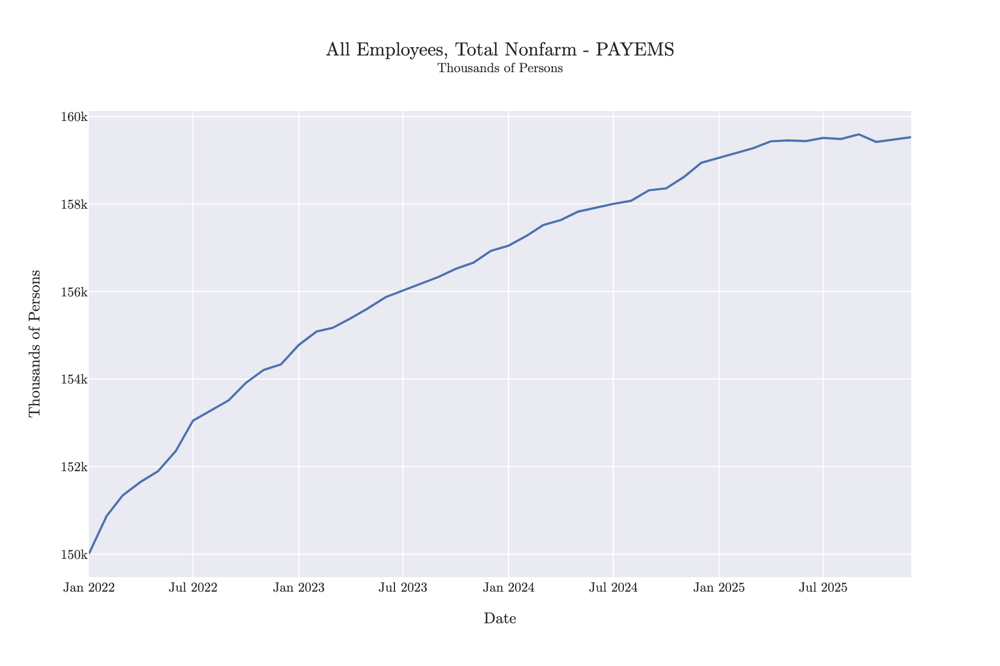
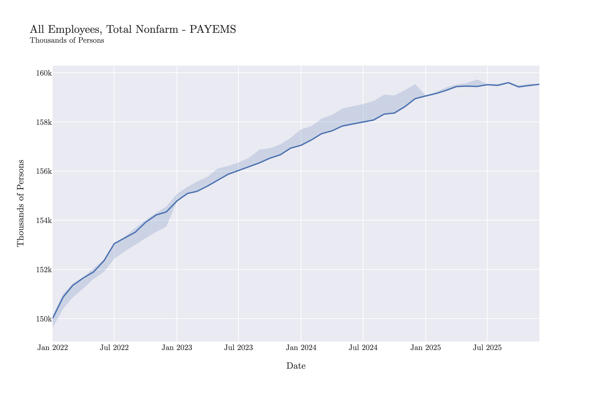
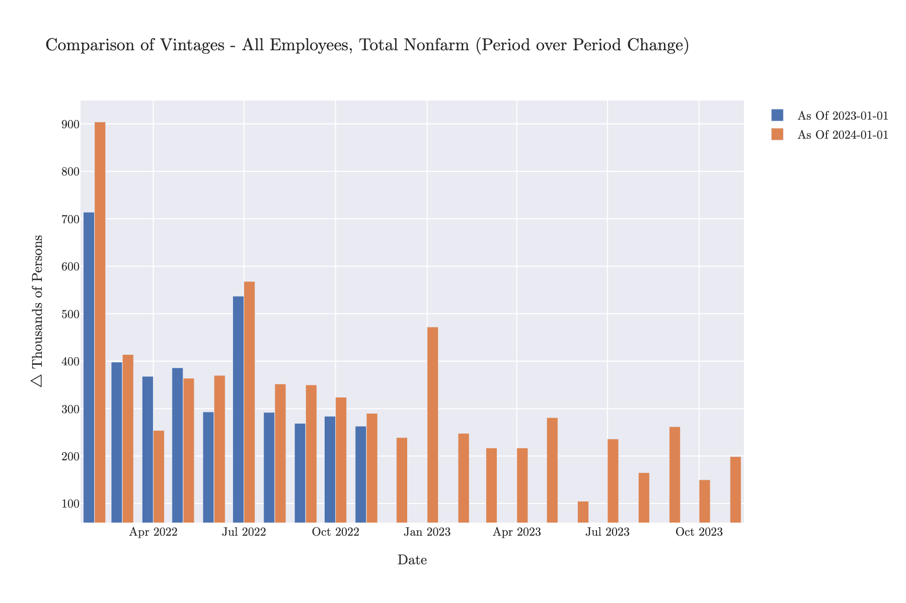
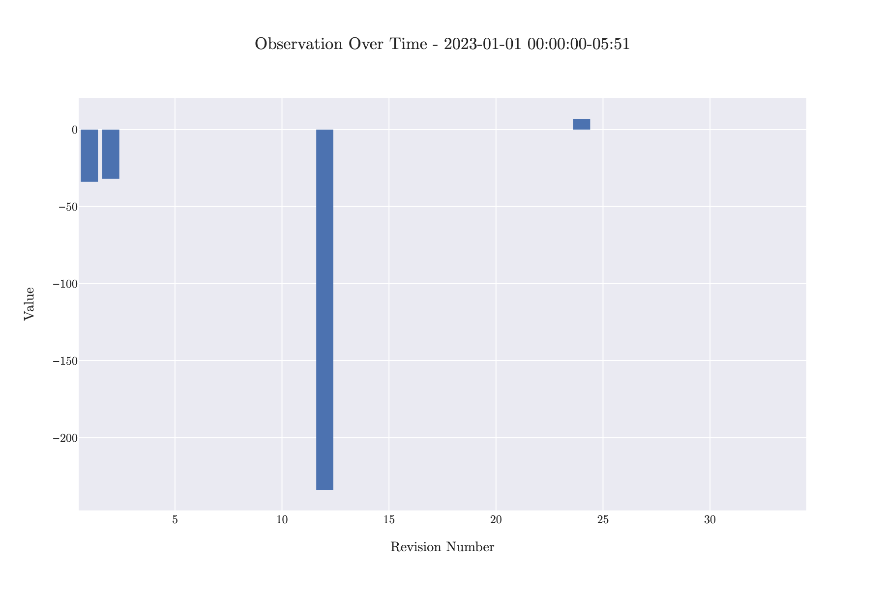
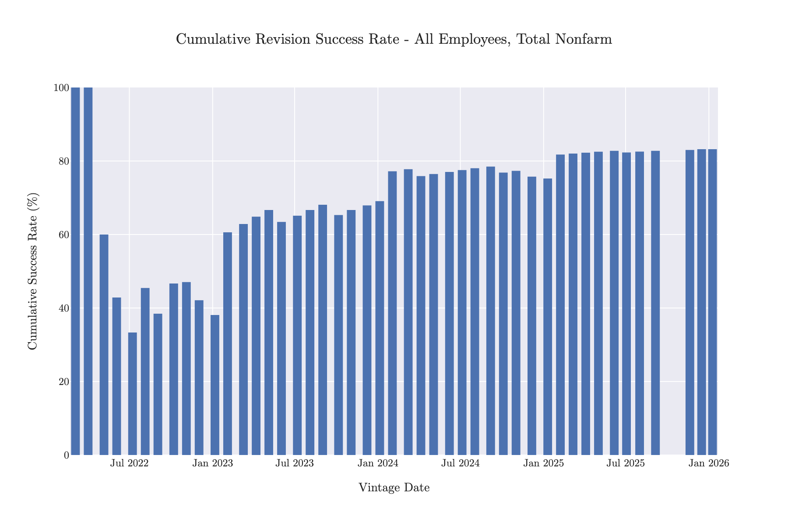
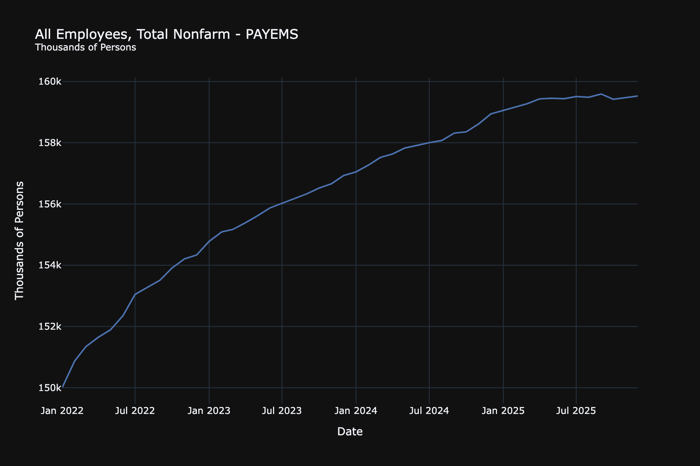

# Graphing and Visualization

MacroTrace provides comprehensive visualization capabilities through the `MTTimeSeriesPlotter` class, accessible via the `.plot` property on any `MTTimeSeries` instance.

## Overview

All plotting in MacroTrace uses Plotly for interactive visualizations. The plotting interface is designed to help you:

- Visualize time series data and vintages
- Analyze revisions over time
- Compare different vintage releases
- Assess revision quality and patterns

## Quick Start

```python
from macrotrace import MTTimeSeries

# Load a time series
ts = MTTimeSeries(
    dataset_id="PAYEMS",
    source="fred",
    data_start_date="2022-01-01",
    data_end_date="2025-12-31",
)

# Create a simple time series plot
timeseries_fig = ts.plot.timeseries()
timeseries_fig.show()
```



## Available Plot Types

### Time Series Plot

Plot the current vintage of your time series:

```python
# Basic time series
timeseries_fig = ts.plot.timeseries()

# With vintage range bands (shows min/max across all vintages)
timeseries_with_range_bands = ts.plot.timeseries(show_vintage_range=True)
timeseries_with_range_bands.show()
```



### Vintage Comparison

Compare multiple vintage releases side-by-side:

```python
# Compare three different vintages
timeseries_comparison_fig = ts.plot.timeseries_comparison(
    vintage_dates=["2023-01-01", "2023-06-01", "2024-01-01"], chart_type="line"
)

# Compare with first differences
timeseries_comparison_diff_fig = ts.plot.timeseries_comparison(
    vintage_dates=["2023-01-01", "2024-01-01"],
    mode="first_difference",
    chart_type="bar",
)
timeseries_comparison_diff_fig.show()
```



### Observation Over Time

Track how a specific observation evolved across revisions:

```python
# See how Jan 2023 payroll data was revised
observation_over_time_fig = ts.plot.observation_over_time(
    observation_datetime="2023-01-01", chart_type="line"
)

# Show first differences (revisions)
observation_over_time_diff_fig = ts.plot.observation_over_time(
    observation_datetime="2023-01-01", first_difference=True
)
observation_over_time_diff_fig.show()
```



### Revision Analysis

Analyze the quality and patterns of revisions:

```python
# Revision histogram
revision_histogram = ts.plot.revision_histogram(mode="first_difference")

# Revision success rate over time
revision_success_fig = ts.plot.revision_success(chart_type="line")

# Bar chart without showing overall rate
revision_success_fig_bar = ts.plot.revision_success(
    chart_type="bar", show_overall_rate=False
)
revision_success_fig_bar.show()
```




## Customization

### Chart Types

Many plotting methods support different chart types:

- `chart_type='line'` - Line charts (default for most)
- `chart_type='bar'` - Bar charts

```python
# Line chart
fig = ts.plot.observation_over_time(
    observation_datetime='2023-01-01',
    chart_type='line'
)

# Bar chart
fig = ts.plot.observation_over_time(
    observation_datetime='2023-01-01',
    chart_type='bar'
)
```

### Display Modes

For vintage comparisons, you can choose different display modes:

- `mode='default'` - Show raw values
- `mode='first_difference'` - Show period-over-period changes
- `mode='pct_change'` - Show percentage changes

```python
fig = ts.plot.timeseries_comparison(
    vintage_dates=['2023-01-01', '2024-01-01'],
    mode='pct_change'
)
```

### MacroTrace Template

All plots use the `MACROTRACE_PLOTLY_LAYOUT_TEMPLATE` for consistent styling. The template is automatically applied to all plots. To customize, modify the layout after creating the figure:

```python
fig = ts.plot.timeseries()
fig.update_layout(template='plotly_dark')  # Change to dark theme
```



### Exporting Figures
You can export Plotly figures to static images or HTML files:

```python
# Export to HTML
fig.write_html("timeseries_plot.html")

# Export to PNG
fig.write_image("timeseries_plot.png")
```
