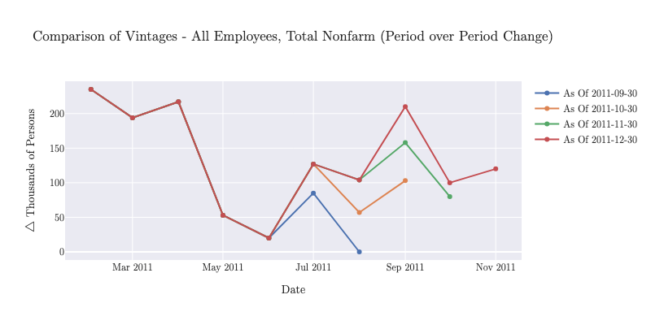

# Overview

## Core Concepts

MacroTrace is built around several key concepts that enable comprehensive tracking and analysis of macroeconomic data revisions.

### Real-Time Data Vintages

Economic data is continuously revised as new information becomes available. MacroTrace provides easy access to these **vintages**, snapshots of data as it appeared at specific points in time.

For example, the United States Non-Farm Payroll is reported monthly by the Bureau of Labor Statistics (BLS). Each month, the initial estimate is released, followed by subsequent revisions in later months as more complete data is collected. Consider the period over period change for US Non-Farm Payroll in August of 2011:
- First released in September 2011: +0 Jobs MoM (July to August)
- Revised in October 2011: +57k Jobs MoM
- Revised in November 2011: +104k Jobs MoM

Each of these is a different **vintage** of the same data point which tells a different story about the economy at that time. MacroTrace allows you to collect and analyze these vintages to understand how data revisions impact economic analysis.



### Data Hierarchy

MacroTrace organizes data in a hierarchical structure:

```
Dataset (includes source + dataset_id)
├── DatasetDimension (versioned dimension definitions)
├── Release (a vintage/snapshot of the dataset)
│   └── ReleaseDimension (which dimension definitions are active in this release)
├── Series (specific combination of dimension values)
│   └── SeriesDimensionFilter (dimension value selections)
└── Observation (links one Series + one Release + timestamp + value)
```

#### Source
The provider of data (FRED, ONS, RTDSM, etc.). Each source has its own API and data structure. In the database schema, `source` is stored as a field on the `Dataset` rather than as a separate model.

#### Dataset
A collection of related series from a source. Each dataset has:
- A unique identifier within the source
- Multiple dimensions that define how data can be filtered
- Multiple releases (vintages) capturing snapshots over time

For example:
- FRED: A specific series identifier like 'PAYEMS' (US Non-Farm Payroll)
- ONS: A dataset like 'gdp-to-four-decimal-places' (UK GDP by region & industry)

#### Series
A specific time series within a dataset, identified by a unique combination of dimension values. Each series:
- Belongs to exactly one dataset
- Has a series key that records the selected values for the dimensions that identify the series
- May have dimension filters that select specific values for dimensions such as geography, industry, or adjustment type
- Represents one unique data series that can be observed across multiple releases

For example, a series might represent:
- Monthly, seasonally adjusted GDP for the United States
- Quarterly, non-seasonally adjusted unemployment for London

#### Series Key
A unique identifier for a series within a dataset, constructed from the dataset ID and the selected dimension values. This key allows easy retrieval and identification of specific series.

Take for example a dataset with the following dimensions:
- Geography: [United States, Canada]
- Industry: [Manufacturing, Services]
- Time
- Value

If we wanted a time series for "United States" and "Manufacturing", the series key would be a dictionary like so:
```
   { "geography": "United States", "industry": "Manufacturing" }
```

We don't include the Time or Value dimensions in the series key, as they are not used to define the identity of the series and are inherent to all time series.

#### Observations
Individual data points that link a specific series to a specific release. Each observation has:
- A reference to a series (which series it belongs to)
- A reference to a release (which vintage it came from)
- An observation timestamp (the time period the data represents)
- A value (the actual data point, or null if missing)

This structure allows tracking how the same data point (same series, same timestamp) changes across different releases.

#### Releases
A release represents a snapshot of a dataset at a specific point in time (a vintage). Each release:
- Belongs to a dataset
- Has a release date (when the data was published)
- Contains multiple observations for various series
- May include different dimensions than previous releases

## Architecture

### Three-Layer Design

MacroTrace uses a three-layer architecture:

1. **Data Sources Layer** (`macrotrace.sources`)
   - API clients for different data providers
   - Managers for datasets, series, and observations
   - Update state tracking

2. **Data Models Layer** (`macrotrace.models`)
   - Database schema using Peewee ORM
   - Data validation and integrity
   - Relationships between entities

3. **Analysis Layer** (`macrotrace`)
   - Time series objects for analysis
   - Revision calculation tools
   - Visualization utilities

### Database Schema

The database uses a normalized schema to efficiently store:

- **Datasets**: Top-level data collections
- **Series**: Individual time series with metadata
- **Observations**: Data points at specific periods
- **Releases**: Vintages of observations
- **Dimensions**: Filters and categories for series

The database is stored locally within the project directory using SQLite in the Macrotrace.db file. This allows for fast local access, offline analysis, and a single file which can be shared within replication packages or version controlled.

## Caching

API responses are cached using `requests-cache` to:
- Reduce API calls
- Speed up repeated queries
- Respect API rate limits
- Enable offline development
