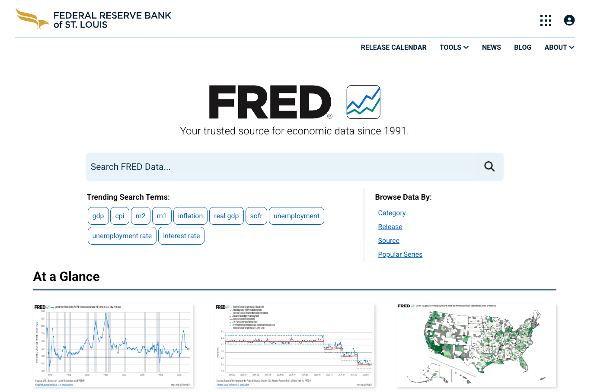
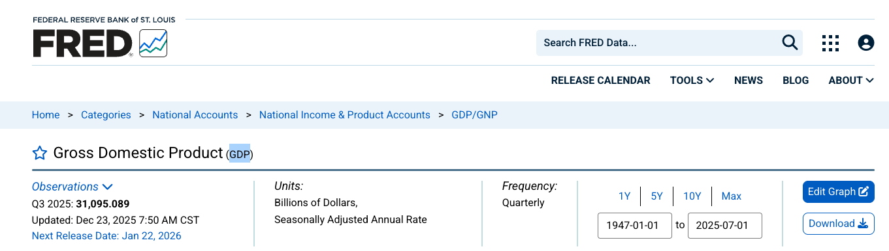

# Federal Reserve Economic Data (FRED)

## Overview

**FRED** ([Federal Reserve Economic Data](https://fred.stlouisfed.org/) is a database maintained by the Research Division of the Federal Reserve Bank of St. Louis. It contains over 800,000 economic time series from national and international sources.

FRED is one of the most comprehensive and widely-used economic databases, providing historical time series data on:

- National and International macroeconomic indicators (GDP, unemployment, inflation)
- Financial markets (interest rates, exchange rates)
- Regional economic data (state and metro area statistics)

## Data Provider

- **Maintained by**: Federal Reserve Bank of St. Louis
- **Website**: [https://fred.stlouisfed.org/](https://fred.stlouisfed.org/)
- **API Documentation**: [https://fred.stlouisfed.org/docs/api/](https://fred.stlouisfed.org/docs/api/fred/)
- **Data Access**: Free with API key registration

## API Key Setup

1. **Register for an API key**: Visit [https://fred.stlouisfed.org/docs/api/api_key.html](https://fred.stlouisfed.org/docs/api/api_key.html)
2. **Set your API key** as an environment variable:

```bash
export FRED_API_KEY='your_api_key_here'
```

Or create a `.env` file in your project root containing the environment variable:

```bash
FRED_API_KEY=your_api_key_here
```

Then load it in your Python script using [`python-dotenv`](https://pypi.org/project/python-dotenv/):

```python
from dotenv import load_dotenv
load_dotenv()
```

## FRED Data Structure

Each series within FRED is organized as a single-dimensional time series identified by a unique `dataset_id` (e.g., `PAYEMS` for Total Nonfarm Payrolls). This means that a series key is not required when loading data from FRED as it is with multi-dimensional datasets from other sources (e.g., ONS).

*Data can be loaded as simply as:*

```python
from macrotrace import MTTimeSeries

# Load time series - this automatically fetches and stores data
payems_series = MTTimeSeries(
    dataset_id="PAYEMS",
    source="fred"
)
```

## Finding Series IDs

[FRED's website](https://fred.stlouisfed.org/) provides a search function to find series by keywords with the option to search by a specific region, release frequency, or data source.



When you find a series of interest, the series ID is displayed directly after the title on the series page. For example, the series ID for United States Gross Domestic Product is `GDP`.



## Troubleshooting

### API Key Not Found

```
Error: FRED_API_KEY not found in environment
```

**Solution**: Ensure your API key is set:
```bash
export FRED_API_KEY='your_key_here'
```

### Series Not Found

```
Error: Series 'XYZ123' not found
```

**Solution**: Verify the series ID at [https://fred.stlouisfed.org/](https://fred.stlouisfed.org/)
