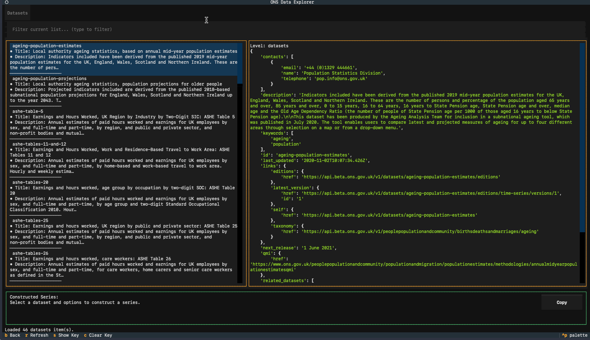
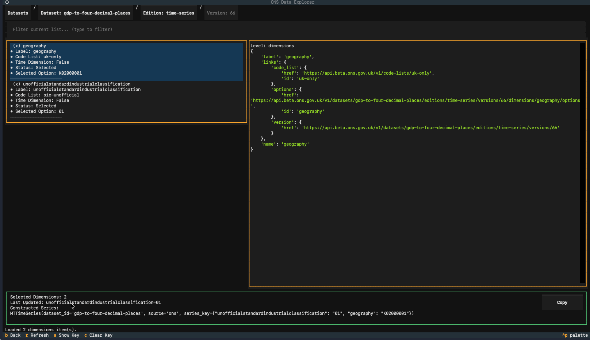

# ONS

## Overview

**ONS** (Office for National Statistics) is the UK's largest independent producer of official statistics and the recognized national statistical institute of the UK. ONS is responsible for collecting and publishing statistics related to the economy, population, and society at national, regional, and local levels.

ONS provides comprehensive data on:

- UK economic indicators (GDP, inflation, employment)
- Population and demographic statistics
- Social statistics and public health
- Business and trade data
- Regional and local area statistics

## Data Provider

- **Maintained by**: Office for National Statistics (UK Government)
- **Website**: [https://www.ons.gov.uk/](https://www.ons.gov.uk/)
- **Developer Hub**: [https://developer.ons.gov.uk/](https://developer.ons.gov.uk/)
- **Data Access**: Free, no API key required

## API Access

The ONS API does not require a key. All data is publicly accessible.

## ONS Data Structure

ONS data is organized into **datasets** which contain multiple **editions** (e.g., time-series). Each edition has one or more **versions** (releases), and each version contains multiple **dimensions** (e.g., geography, industry classification). You must specify a `series_key` to select a specific slice of the dataset for analysis. Not all datasets have time-series editions, so you should check the ONS Developer Hub or the optional TUI for dataset details and to build their `series_key`.

Macrotrace can only interface with datasets which have a **"time-series"** release.

### Example ONS Dataset Structure

```
Dataset: regional-gdp-by-quarter
  Edition: time-series
    Version: 1
      Dimension: geography
        Option: UK0
        Option: K02000001
        ...
      Dimension: unofficialstandardindustrialclassification
        Option: A--T
        Option: B-E
        ...
```

## Finding Series IDs and Building Series Keys

Currently, the ONS does not provide an easy UI to assemble series keys. In the API's current state, you must explore the dataset metadata via API to find the relevant dimensions and options, then construct their `series_key` manually. The optional ONS TUI provides an interactive way to browse datasets, editions, versions, dimensions, and options to build a valid `series_key` without needing to read through API documentation.

If Macrotrace is installed in your environment with the ONS TUI extra, you can run the ONS tools through
the top-level `macrotrace` command:

Examples:

```bash
# From PyPI, install the published package with the ONS TUI extra:
# pip install "macrotrace[ons-tui]"
# or: uv tool install "macrotrace[ons-tui]"

# Textual + Rich TUI:
macrotrace ons tui

# Include datasets that do not have a time-series edition:
macrotrace ons tui --include-non-time-series
```

```bash
# From a local checkout, install optional ONS Text User Interface (TUI) dependencies:
uv sync --extra ons-tui

# Then, use uv run:
uv run macrotrace ons tui
```

### Standalone CLIs

Installing `macrotrace` also registers two standalone entry points that
are equivalent to running the nested commands above. They are
convenient when you want to drop the `macrotrace ons` prefix or wire
the explorer into shell scripts:

| Entry point                     | Equivalent to               |
|---------------------------------|-----------------------------|
| `macrotrace-ons-explorer`       | `macrotrace ons explorer`   |
| `macrotrace-ons-explorer-tui`   | `macrotrace ons tui`        |

Both honor the same flags as their nested counterparts (e.g.
`--include-non-time-series`, `--no-cache`).

### Exploring Datasets with the ONS TUI

In the TUI you can explore datasets, editions, versions, dimensions, and options to build a valid `series_key` without needing to write the API calls yourself. **Note that initial startup will take some time as the TUI fetches and caches metadata for all datasets.** Subsequent runs will be much faster due to caching.

The TUI is organized into two tabs. The left-hand tab shows the options for the currently selected location in the dataset hierarchy, while the right-hand tab shows the returned data from the API for that API call. You can navigate using arrow keys and select options with Enter or via the mouse.



The TUI will automatically build a valid `series_key` for you as you select dimensions and options. Once you have selected all relevant dimensions to assemble your `series_key`, you can press the "Copy Series Key" button to copy the assembled `series_key` to your clipboard for use in your code. This can then be pasted into your code when initializing an `MTTimeSeries` to load that specific slice of the dataset. The TUI also shows you the raw API response for each selection you make, which can be helpful for understanding the ONS data structure and debugging any issues with assembling your `series_key`.



## Troubleshooting

- If API calls are slow, keep caching enabled (default behavior) so repeated exploration runs use cached responses.
- If you encounter errors about missing or invalid `series_key`, double-check that you have selected the correct dimensions and options in the TUI to build a valid `series_key` for that dataset.
